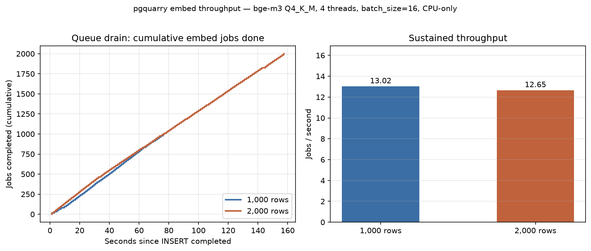
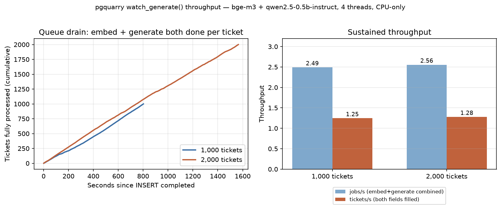

# Local throughput: embed-only vs watch_generate()

Two local benchmarks of pgquarry's trigger → queue → worker path, each run
at 1,000 and 2,000 rows: does throughput hold steady as batch size grows,
and how much slower is the combined embed+generate path than embed alone?

- [Benchmark 1: `docs`, embed-only](#benchmark-1-docs-embed-only-pgquarrytomlexample)
- [Benchmark 2: `tickets`, `watch_generate()`](#benchmark-2-tickets-watch_generate-pgquarrygenerate-testtoml)

## Environment

| | |
|---|---|
| CPU | Intel Core Ultra 7 155H, 4 vCPUs exposed to the VM (no hyperthreading visible), no GPU (VMware SVGA II — display only, `n_gpu_layers = 0` everywhere) |
| RAM | 7.5 GiB (VM) |
| OS | Rocky Linux 10.1, kernel 6.12.0-211.46.1.el10_2.x86_64 |
| PostgreSQL | 16.14 |
| `pgquarry_worker` build | `RelWithDebInfo` (see main README's Quick start — a `Debug` build is 10-20x slower for inference) |
| Embedding model | `bge-m3-Q4_K_M.gguf` |
| Generation model | `qwen2.5-0.5b-instruct-q4_k_m.gguf` (ticket benchmark only) |

## Benchmark 1: `docs`, embed-only (`pgquarry.toml.example`)

`n_threads=4`, `n_ctx=512`, `batch_size=16`, `poll_interval_ms=250`, no
generation model loaded.

```sql
CREATE TABLE docs (
    id        bigserial PRIMARY KEY,
    body      text NOT NULL,
    embedding vector(1024)
);
SELECT pgquarry.watch('docs', 'body', 'embedding');
```

### Method

For each batch size: record a timestamp, run one bulk `INSERT INTO docs
(body) VALUES (...), (...), ...` of synthetic sentences (~15 words each,
similar in shape to the README's own examples), then poll
`pgquarry.jobs` until every job the trigger enqueued reaches `status =
'done'`. The 2,000-row batch is a separate run against an emptied queue, not
a continuation of the 1,000-row one — both start from an idle worker.

Per-job wait time is `updated_at - created_at` from `pgquarry.jobs`, i.e.
time from enqueue to write-back, which for a burst insert is dominated by
queue position (jobs near the back of a 2,000-row burst wait for everything
ahead of them) rather than per-job inference cost.

### Results



| Batch | Jobs | Insert time | Queue drain time | Throughput | Mean wait | p50 wait | p95 wait | p99 wait |
|---|---|---|---|---|---|---|---|---|
| 1,000 rows | 1,000 | 0.13s | 76.80s | 13.02 jobs/s | 39.82s | 40.39s | 73.56s | 76.21s |
| 2,000 rows | 2,000 | 0.16s | 158.10s | 12.65 jobs/s | 77.43s | 76.98s | 150.01s | 156.43s |

No errors in either run.

### Takeaways

- **Throughput is flat across batch size** (13.02 vs 12.65 jobs/s, ~3%
  apart) — doubling the burst size roughly doubled the drain time (76.8s →
  158.1s) rather than degrading super-linearly, so `SELECT ... FOR UPDATE
  SKIP LOCKED` polling isn't adding measurable per-job overhead as the queue
  gets deeper at this scale.
- **This is a single CPU worker, single-threaded through the model** — the
  ~76ms/job service time is bge-m3 Q4_K_M inference on 4 threads, not
  pgquarry's own overhead (insert-to-first-claim latency is under a second;
  see the `min wait` column). Multiple `pgquarry_worker` processes against
  the same queue, more threads, or `n_gpu_layers > 0` on a machine with a
  real GPU would all be expected to move this number — untested here.
- **Wait time, not service time, is what a caller sees for a burst insert.**
  A job at the tail of a 2,000-row burst waits ~157s even though its own
  embedding takes ~76ms — expected for a FIFO single-worker queue, but worth
  knowing if you're sizing `embed_sync()`'s `timeout_ms` for bulk-insert
  scenarios rather than one-off ad hoc calls.

## Benchmark 2: `tickets`, `watch_generate()` (`pgquarry.generate-test.toml`)

Same worker box, same 4 threads, but now split between two GGUF models: the
same `bge-m3-Q4_K_M.gguf` for embedding and `qwen2.5-0.5b-instruct-q4_k_m.gguf`
for generation (`generation_n_threads=4`, `generation_n_ctx=2048`,
`generation_max_tokens=128`). One trigger enqueues **two** jobs per row —
`embed` and `generate` — from a single INSERT (see `enqueue_job()`'s header
comment in `sql/pgquarry--1.0.sql`):

```sql
CREATE TABLE tickets (
    id        bigserial PRIMARY KEY,
    body      text NOT NULL,
    prompt    text GENERATED ALWAYS AS ('Summarize this ticket in one sentence: ' || body) STORED,
    embedding vector(1024),
    summary   text
);
SELECT pgquarry.watch_generate('tickets', 'body', 'embedding', 'prompt', 'summary');
```

### Method

Same shape as Benchmark 1 — bulk `INSERT INTO tickets (body) VALUES (...)`
of synthetic support-ticket-style sentences, then poll `pgquarry.jobs`
until every enqueued job (2× the row count) is `done`. A "ticket fully
processed" timestamp is `max(updated_at)` across that ticket's `embed` and
`generate` job pair, joined on `source_id` — pairing on `created_at` doesn't
work here since every row in one bulk `INSERT` shares the same transaction
timestamp.

### Results



| Batch | Rows | Jobs | Queue drain time | Job throughput | Row throughput |
|---|---|---|---|---|---|
| 1,000 tickets | 1,000 | 2,000 (1k embed + 1k generate) | 802.86s | 2.49 jobs/s | 1.25 tickets/s |
| 2,000 tickets | 2,000 | 4,000 (2k embed + 2k generate) | 1565.17s | 2.56 jobs/s | 1.28 tickets/s |

| Batch | Job type | Mean wait | p50 wait | p95 wait | p99 wait |
|---|---|---|---|---|---|
| 1,000 tickets | embed | 422.49s | 440.62s | 763.79s | 791.51s |
| 1,000 tickets | generate | 425.67s | 444.14s | 768.65s | 795.76s |
| 2,000 tickets | embed | 757.99s | 746.18s | 1481.64s | 1548.48s |
| 2,000 tickets | generate | 761.11s | 747.22s | 1486.06s | 1551.20s |

No errors in either run.

### Takeaways

- **~10x slower than embed-only** (1.25-1.28 tickets/s fully processed vs.
  ~13 rows/s in Benchmark 1) — expected, since each ticket now costs one
  embed inference *and* one generate inference (up to 128 tokens,
  autoregressive, one token at a time) against models sharing the same 4 CPU
  threads. Generation service time dominates: embed alone was ~76ms/job in
  Benchmark 1, but here the average job (embed or generate, either one) costs
  ~401ms (802.86s / 2,000 jobs), and a ticket needs both — ~803ms of total
  worker time per ticket (802.86s / 1,000 tickets) even though the two jobs
  finish close together in wall-clock terms (see the near-identical
  embed/generate wait times below).
- **Throughput held steady again at 2x batch size** (2.49 vs 2.56 jobs/s,
  ~3% apart, same as Benchmark 1) — the queue mechanism itself isn't what's
  slow here; it scales the same way regardless of job type mix.
- **Embed and generate jobs finish in near lockstep**, not with embed
  racing ahead — mean/p50 wait times are within ~1% of each other per
  batch. The worker doesn't appear to prioritize one job type over the
  other; both drain from roughly the same position in the combined queue.
- **Sizing implication**: if a caller is watching `summary` (or any
  `generate`-backed column) fill in after a bulk insert, budget for the
  *tickets/s* number, not the *jobs/s* one — `timeout_ms` in a hypothetical
  `generate_sync()`-style wait, or any polling loop, needs headroom for
  worst-case queue position (p99 wait was ~99% of total drain time in both
  runs here), not just mean throughput.
- Local-model generation is inherently the expensive part of this pipeline;
  a real `generation_n_gpu_layers > 0` setup or a larger/faster generation
  model would move this number a lot more than tuning embed-side knobs
  would — untested here (no GPU on this box).

## Reproducing

Benchmark 1 (`docs`, `pgquarry_worker --config pgquarry.toml.example`):

```bash
psql "$CONNINFO" -c "SELECT count(*) FROM docs;"   # confirm empty/expected state first
# generate and insert a batch, e.g. 1000 synthetic rows into docs(body)
# then poll:
psql "$CONNINFO" -tAc \
  "SELECT count(*) FROM pgquarry.jobs WHERE status IN ('pending','processing');"
# once 0, per-job wait times are available via:
psql "$CONNINFO" -c \
  "SELECT id, updated_at - created_at AS wait FROM pgquarry.jobs ORDER BY id;"
```

Benchmark 2 (`tickets`, `pgquarry_worker --config pgquarry.generate-test.toml`
— needs a generation GGUF at `generation_model_path`, see that file):

```bash
psql "$CONNINFO" -c "SELECT count(*) FROM tickets;"
# generate and insert a batch, e.g. 1000 synthetic rows into tickets(body)
# then poll (2 jobs enqueued per row — embed and generate):
psql "$CONNINFO" -tAc \
  "SELECT count(*) FROM pgquarry.jobs WHERE source_table='tickets' AND status IN ('pending','processing');"
# once 0, per-ticket completion time (both jobs done) via:
psql "$CONNINFO" -c \
  "SELECT source_id, max(updated_at) - min(created_at) AS ticket_span
     FROM pgquarry.jobs WHERE source_table='tickets' GROUP BY source_id ORDER BY source_id;"
```
